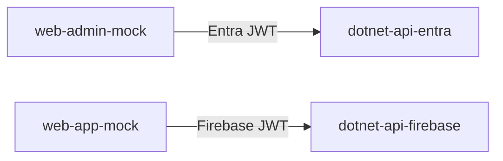
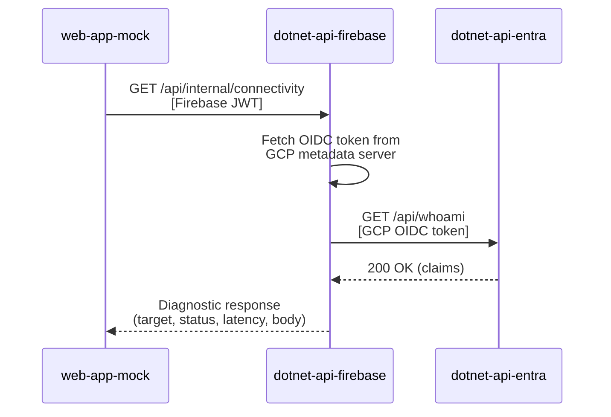

# Authentication and Internal Connectivity Lab

This lab demonstrates two authentication patterns on Google Cloud Run and validates internal service-to-service connectivity through a defined network path (internal load balancer, internal DNS).

## Applications

The lab consists of four applications that work together:

| Application           | Type           | Port (local) | Authentication                    |
| --------------------- | -------------- | ------------ | --------------------------------- |
| `dotnet-api-entra`    | .NET 8 API     | 8081         | Microsoft Entra ID (Azure AD) JWT |
| `dotnet-api-firebase` | .NET 8 API     | 8080         | Firebase JWT                      |
| `web-admin-mock`      | Static (nginx) | 3090         | MSAL popup flow against Entra ID  |
| `web-app-mock`        | Static (nginx) | 3091         | Firebase SDK                      |

## How the lab works

There are two independent authentication flows and one internal connectivity test that bridges them.

### External authentication flows

Each frontend authenticates users through its own identity provider and calls its corresponding backend API:



Both APIs expose the same endpoints:

- `GET /` -- service info (unauthenticated)
- `GET /healthz` -- health check (unauthenticated)
- `GET /api/whoami` -- caller identity from JWT claims (authenticated)

When deployed behind a Google Cloud API Gateway, the gateway validates the client JWT and forwards it to the backend via the `X-Forwarded-Authorization` header. Both APIs extract tokens from this header when present, falling back to the standard `Authorization` header.

### Internal connectivity test

The firebase API has a diagnostic endpoint that calls the entra API internally:



This validates:

- **Network connectivity** -- the request reaches the entra API through the configured route
- **DNS resolution** -- the internal hostname or load balancer address resolves correctly
- **Load balancer routing** -- path-based routing delivers the request to the correct service
- **GCP service identity** -- the firebase API's service account can obtain an OIDC identity token from the metadata server
- **Multi-scheme authentication** -- the entra API accepts GCP OIDC tokens alongside Entra ID JWTs

The connectivity endpoint returns a diagnostic response:

```json
{
  "target": "http://internal-lb/customers/api/whoami",
  "authAttached": true,
  "statusCode": 200,
  "latencyMs": 45,
  "response": {
    "service": "dotnet-api-entra",
    "is_authenticated": true,
    "...": "..."
  },
  "error": null
}
```

### How internal auth works

In Cloud Run, the firebase API fetches an OIDC identity token from the GCP metadata server:

```txt
GET http://metadata.google.internal/.../identity?audience={INTERNAL_OIDC_AUDIENCE}
```

This returns a JWT signed by Google (`https://accounts.google.com`) containing the firebase API's service account identity. The entra API validates this token as a second authentication scheme alongside its existing Entra ID JWT validation. Both schemes are accepted on all protected endpoints when `INTERNAL_AUTH_ENABLED=true`.

A config toggle (`INTERNAL_AUTH_ENABLED`) controls this behavior. When `false`, the firebase API does not attach a token and the entra API only registers its Entra ID auth scheme.

## Running locally with Docker Compose

The `compose.auth-example.yaml` file runs all four applications on a shared Docker network.

### Prerequisites

Set the following environment variables before running (e.g., in a `.env` file or exported in your shell):

| Variable                       | Description                                                                 |
| ------------------------------ | --------------------------------------------------------------------------- |
| `AZURE_AD_TENANT_ID`           | Microsoft Entra ID (Azure AD) tenant ID                                     |
| `AZURE_AD_CLIENT_ID`           | Entra app registration client ID                                            |
| `AZURE_AD_API_SCOPES`          | API scopes for token acquisition (e.g., `api://{client-id}/access_as_user`) |
| `GOOGLE_CLOUD_PROJECT`         | GCP project ID                                                              |
| `FIREBASE_PROJECT_ID`          | Firebase project ID                                                         |
| `FIREBASE_API_KEY`             | Firebase web API key                                                        |
| `FIREBASE_AUTH_DOMAIN`         | Firebase auth domain (e.g., `{project}.firebaseapp.com`)                    |
| `FIREBASE_STORAGE_BUCKET`      | Firebase storage bucket                                                     |
| `FIREBASE_MESSAGING_SENDER_ID` | Firebase messaging sender ID                                                |
| `FIREBASE_APP_ID`              | Firebase app ID                                                             |

### Start the lab

```sh
cd apps
docker compose -f compose.auth-example.yaml up --build
```

### Local endpoints

| URL                     | Application                  |
| ----------------------- | ---------------------------- |
| `http://localhost:3090` | Admin portal (Entra auth)    |
| `http://localhost:3091` | Customer app (Firebase auth) |
| `http://localhost:8081` | Entra API (direct)           |
| `http://localhost:8080` | Firebase API (direct)        |

### Testing the connectivity endpoint locally

1. Open `http://localhost:3091` and sign in with Firebase credentials
2. Click **GET /api/internal/connectivity**
3. The log panel displays the diagnostic response

Locally, `INTERNAL_AUTH_ENABLED` is `false`, so the firebase API does not attach an OIDC token to the internal call. Since the entra API's `/api/whoami` requires authentication, the downstream response will be a `401`. This is expected -- it confirms that the network path works (the request reached the entra API and a response came back). To get a `200` locally, change `CUSTOMERS_ENDPOINT` to `/healthz` in the compose file.

## Cloud Run configuration

Each application expects specific environment variables when deployed to Cloud Run. The sections below describe what each service needs configured, independent of how the deployment is performed.

### dotnet-api-entra

| Variable                 | Description                               | Example                                  |
| ------------------------ | ----------------------------------------- | ---------------------------------------- |
| `AzureAd__TenantId`      | Entra ID tenant ID                        | `xxxxxxxx-xxxx-xxxx-xxxx-xxxxxxxxxxxx`   |
| `AzureAd__ClientId`      | Entra app registration client ID          | `xxxxxxxx-xxxx-xxxx-xxxx-xxxxxxxxxxxx`   |
| `Cors__Origins__0`       | First allowed CORS origin                 | `https://admin.example.com`              |
| `INTERNAL_AUTH_ENABLED`  | Register GCP OIDC as a second auth scheme | `true`                                   |
| `INTERNAL_OIDC_AUDIENCE` | Expected audience in GCP OIDC tokens      | Must match the value on the firebase API |

### dotnet-api-firebase

| Variable                 | Description                                        | Example                                 |
| ------------------------ | -------------------------------------------------- | --------------------------------------- |
| `Firebase__ProjectId`    | Firebase project ID (falls back to GCP project ID) | `my-project`                            |
| `Cors__Origins__0`       | First allowed CORS origin                          | `https://app.example.com`               |
| `INTERNAL_API_BASE_URL`  | Base URL of the internal load balancer             | `https://internal-api.example.internal` |
| `CUSTOMERS_ENDPOINT`     | Path to the downstream endpoint on the internal LB | `/customers/api/whoami`                 |
| `INTERNAL_AUTH_ENABLED`  | Attach GCP OIDC token to internal calls            | `true`                                  |
| `INTERNAL_OIDC_AUDIENCE` | OIDC audience to request from the metadata server  | Must match the value on the entra API   |

`INTERNAL_OIDC_AUDIENCE` must be identical on both services. It is the value the firebase API requests when fetching its identity token, and the value the entra API validates against. A typical choice is the internal load balancer URL or a custom audience string agreed upon between services.

### web-admin-mock

| Variable             | Description                           | Example                                         |
| -------------------- | ------------------------------------- | ----------------------------------------------- |
| `APP_API_BASE_URL`   | URL of the entra API (or API Gateway) | `https://api.example.com`                       |
| `APP_MSAL_CLIENT_ID` | MSAL client ID                        | `xxxxxxxx-xxxx-xxxx-xxxx-xxxxxxxxxxxx`          |
| `APP_MSAL_AUTHORITY` | Entra ID authority URL                | `https://login.microsoftonline.com/{tenant-id}` |
| `APP_API_SCOPES`     | Comma-separated API scopes            | `api://{client-id}/access_as_user`              |

### web-app-mock

| Variable                           | Description                              | Example                     |
| ---------------------------------- | ---------------------------------------- | --------------------------- |
| `APP_API_BASE_URL`                 | URL of the firebase API (or API Gateway) | `https://api.example.com`   |
| `APP_FIREBASE_API_KEY`             | Firebase web API key                     |                             |
| `APP_FIREBASE_AUTH_DOMAIN`         | Firebase auth domain                     | `{project}.firebaseapp.com` |
| `APP_FIREBASE_PROJECT_ID`          | Firebase project ID                      |                             |
| `APP_FIREBASE_STORAGE_BUCKET`      | Firebase storage bucket                  |                             |
| `APP_FIREBASE_MESSAGING_SENDER_ID` | Firebase messaging sender ID             |                             |
| `APP_FIREBASE_APP_ID`              | Firebase app ID                          |                             |

## What the lab validates

| Concern                       | How it is validated                                                                             |
| ----------------------------- | ----------------------------------------------------------------------------------------------- |
| Entra ID JWT authentication   | Admin portal signs in via MSAL, calls `/api/whoami` on entra API                                |
| Firebase JWT authentication   | Customer app signs in via Firebase SDK, calls `/api/whoami` on firebase API                     |
| API Gateway token forwarding  | Both APIs read tokens from `X-Forwarded-Authorization` when behind a gateway                    |
| CORS configuration            | Frontends on different origins call APIs with appropriate CORS headers                          |
| Internal network connectivity | Firebase API calls entra API through the internal LB; diagnostic response confirms reachability |
| Internal DNS resolution       | The internal call uses the configured base URL, verifying DNS resolves to the correct target    |
| GCP OIDC service identity     | Firebase API obtains an identity token from the metadata server for service-to-service auth     |
| Multi-scheme JWT validation   | Entra API accepts both Entra ID JWTs (external) and GCP OIDC tokens (internal)                  |
| Health checks and readiness   | All services expose `/healthz`; Docker Compose and Cloud Run use it for health probes           |
